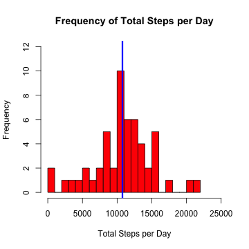
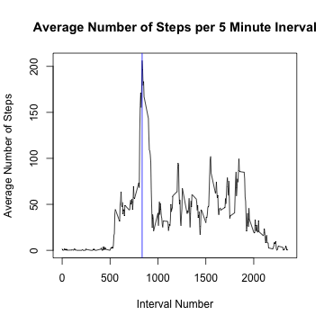
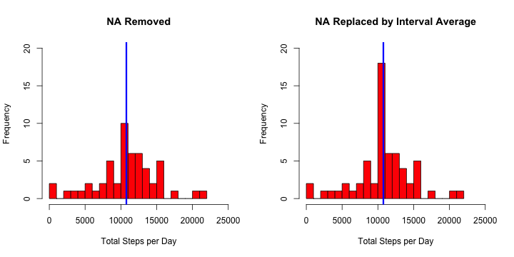

# Reproducible Research: Peer Assessment 1
|                |                                                        |
|:---------------|:-------------------------------------------------------|
|**Author:**     | Brian von Konsky
|**Created:**    | May 2014
|**Course:**     | Reproducible Research (Johns Hopkins University via Coursera)
|**Repository:** | [https://github.com/bvonkonsky/RepData_PeerAssessment1](https://github.com/bvonkonsky/RepData_PeerAssessment1)

## Loading and preprocessing the data

**Step 1.** Specify the location of files and directories.

```r
# Set file names
original <- "https://d396qusza40orc.cloudfront.net/repdata%2Fdata%2Factivity.zip"
directory <- "."
zip <- "activity.zip"
data <- "activity.csv"

# Create OS idependent filenames for path to zip archive and data
path.zip <- file.path(directory, zip)
path.data <- file.path(directory, data)
```

**Step 2.** Download the zip archive if it doesn't exist in the current working
directory.

```r
if (!file.exists(zip)) {
    download.file(original, path.zip, method = "curl")
}
```

**Step 3.** Unzip the archive and read the data.

```r
# Unzip the archive
unzip(path.zip)

# Read the data from the csv file
activity <- read.csv(path.data, header = TRUE)
```

**Step 4.** Convert dates to objects of class Date.

```r
activity$date <- as.Date(activity$date)
```

**Step 5.** Five minute time intervals are initially in the form HHDD.  This 
must be converted to minutes since the beginning of the day to avoid uneven 
spacing at hour boundaries. For example, 0120 is 1:20 AM, which is converted to 
1*60 + 20 or 80. Without such a conversion, at the 0:55 to 1:00 AM boundary, 
the interval would go from 55 to 100 instead of from 55 to 60. The conversion 
in this step maintains uniform 5 minute spacing across hour boundaries.

```r
activity$interval <- unlist(lapply(activity$interval, function(x) {
    # Get the hour component of the equivalent four character strng
    hr <- as.integer(substring(sprintf("%04d", x), 1, 2))
    
    # Get the minute component of the equivalent four character string
    min <- as.integer(substring(sprintf("%04d", x), 3, 4))
    
    # Return total minutes since the beginning of the day
    return(hr * 60 + min)
}))
```

**Step 6.** Subset and aggregate data that will be used in this analysis. 
NA values are ignored when calculating means and sums in the aggregated data. 
As shown on the 
[aggregate](http://stat.ethz.ch/R-manual/R-devel/library/stats/html/aggregate.html) 
help page, the **na.action** default is to ignore NA values.

```r
# Aggregate to caluclate the total number of steps per day
stepsPerDayNoNA <- aggregate(steps ~ date, activity, sum)
names(stepsPerDayNoNA) <- c("date", "steps.sum")

# Aggregate to calculate the average number of steps per interval
avgPerIntervalNoNA <- aggregate(steps ~ interval, activity, mean)
names(avgPerIntervalNoNA) <- c("interval", "steps.mean")
```

**Step 6.** Inspect the activity data frame and its subsets to confirm correct 
processing.

```r
str(activity)
```

```
## 'data.frame':	17568 obs. of  3 variables:
##  $ steps   : int  NA NA NA NA NA NA NA NA NA NA ...
##  $ date    : Date, format: "2012-10-01" "2012-10-01" ...
##  $ interval: num  0 5 10 15 20 25 30 35 40 45 ...
```

```r
str(stepsPerDayNoNA)
```

```
## 'data.frame':	53 obs. of  2 variables:
##  $ date     : Date, format: "2012-10-02" "2012-10-03" ...
##  $ steps.sum: int  126 11352 12116 13294 15420 11015 12811 9900 10304 17382 ...
```

```r
str(avgPerIntervalNoNA)
```

```
## 'data.frame':	288 obs. of  2 variables:
##  $ interval  : num  0 5 10 15 20 25 30 35 40 45 ...
##  $ steps.mean: num  1.717 0.3396 0.1321 0.1509 0.0755 ...
```


## What is mean total number of steps taken per day?

A histogram showing the frequency with which the subject
walked a given total steps per day is shown below. The mean number of steps per 
day is shown with a blue line.

```r
# The totalSteps function plots a histogram showing the frequency of total
# steps per day
totalSteps <- function(stepsPerDay, title = "Frequency of Total Steps per Day", 
    yrange = c(0, 12)) {
    with(stepsPerDay, {
        
        # Plot the frequency of Total Steps per Day
        hist(steps.sum, col = "red", breaks = 20, xlab = "Total Steps per Day", 
            main = title, xlim = c(0, 25000), ylim = yrange)
        
        # Use a blue line to show the mean value
        abline(v = mean(steps.sum), col = "blue", lwd = 3)
    })
    
}

# Generate a histogram for the total number of steps per day wit no NA
# values
totalSteps(stepsPerDayNoNA)
```



The mean and median total number of steps per day is  **10800**. The mean and
median, together with other summary statistics is calculated with the 
`summary()` function.

```r
with(stepsPerDayNoNA, summary(steps.sum))
```

```
##    Min. 1st Qu.  Median    Mean 3rd Qu.    Max. 
##      41    8840   10800   10800   13300   21200
```


## What is the average daily activity pattern?

A plot showing the time series with the average number of steps per 5 minute 
interval is shown below. The interval with the maximum average
number of steps per interval is shown with a blue line.  The maximum average
steps per interval and the interval in which it occurs is also calculated in 
[R](http://www.r-project.org/). The
maximum value is **206.2**, and occurs in the 5 minute interval commencing at
minute **515** in row **104** of the aggregated data.

```r
with(avgPerIntervalNoNA, {
    # Determine which row contains the maximum avergage number of steps per
    # interval
    maxRow <- which.max(steps.mean)
    
    # Plot the time series
    plot(interval, steps.mean, type = "l", xlab = "Interval (minutes)", ylab = "Average Number of Steps", 
        main = "Average Number of Steps per 5 Minute Inerval")
    
    # Show where the maximum average steps occur
    abline(v = interval[maxRow], col = "blue")
    
    # Display the maximum value and the interval in which it occurs
    print(avgPerIntervalNoNA[maxRow, ])
})
```



```
##     interval steps.mean
## 104      515      206.2
```


## Imputing missing values
The number of observations containing NA values for the number of steps, and
the number of days on which this occurs is calculated below. As shown, there
were 2304 NA entries on unique 8 days.

```r
activity.na <- subset(activity, is.na(steps))
days <- unique(activity.na$date)
num.na <- nrow(activity.na)
num.days <- length(days)
print(paste("There are", num.na, "NA entries on", num.days, "unique days"))
```

```
## [1] "There are 2304 NA entries on 8 unique days"
```

The 8 days containing NA values are given below.

```r
days
```

```
## [1] "2012-10-01" "2012-10-08" "2012-11-01" "2012-11-04" "2012-11-09"
## [6] "2012-11-10" "2012-11-14" "2012-11-30"
```

NA values were replaced by the mean value for the intervals in which they 
occurred. Given that there were 8 days in which all values were NA, this 
strategy had the net impact of increasing the frequency of total steps per day 
at the median by 8. This is demonstrated in the plot below.

```r
# Set NA entries to the mean value for that time interval
activityAvgNA <- activity
for (i in c(0, seq(5, 2355, 5))) {
    match <- is.na(activityAvgNA$steps) & (activityAvgNA$interval == i)
    activityAvgNA$steps[match] <- mean(activityAvgNA$steps[activityAvgNA$interval == 
        i], na.rm = TRUE)
}

# Compute the total steps for each day using the imputed data
stepsPerDayAvgNA <- aggregate(steps ~ date, activityAvgNA, sum)
names(stepsPerDayAvgNA) <- c("date", "steps.sum")

# Plot both versions side by side for comparison purposes
par(mfrow = c(1, 2))
totalSteps(stepsPerDayNoNA, "NA Removed", yrange = c(0, 20))
totalSteps(stepsPerDayAvgNA, "NA Replaced by Interval Average", yrange = c(0, 
    20))
```



As expected, the mean and median values remained the same, despite the increase
in the frequency with which the mean total steps per day occurred.

```r
summary(stepsPerDayNoNA$steps.sum)
```

```
##    Min. 1st Qu.  Median    Mean 3rd Qu.    Max. 
##      41    8840   10800   10800   13300   21200
```

```r
summary(stepsPerDayAvgNA$steps.sum)
```

```
##    Min. 1st Qu.  Median    Mean 3rd Qu.    Max. 
##      41    9820   10800   10800   12800   21200
```


## Are there differences in activity patterns between weekdays and weekends?
The subject was the most active early in the morning on weekdays, but overall
was generally more active on weekends.

```r

# Generate days of the week for activity in which NA values have been
# replaced with the average for that interval
dow <- weekdays(activityAvgNA$date, abbreviate = FALSE)

# Generate factors for weekend versus weekdays
fac <- rep("unset", length(dow))
fac[dow == "Sunday" | dow == "Saturday"] <- "weekend"
fac[dow != "Sunday" & dow != "Saturday"] <- "weekday"

# Add the factors to the data
activityAvgNA <- cbind(activityAvgNA, day.week = dow, day.type = fac)
names(activityAvgNA) <- c("steps", "date", "interval", "day.week", "day.type")

# Subset the data by weekend and weekdays
weekday <- subset(activityAvgNA, day.type == "weekday")
weekend <- subset(activityAvgNA, day.type == "weekend")

# Compute the mean for aggregated weekday data
weekdayAvgPerInterval <- aggregate(steps ~ interval, weekday, mean)
names(weekdayAvgPerInterval) <- c("interval", "steps.mean")

# Compute the mean for aggregated weekend data
weekendAvgPerInterval <- aggregate(steps ~ interval, weekend, mean)
names(weekendAvgPerInterval) <- c("interval", "steps.mean")

# Plot the result
par(mfrow = c(2, 1), mar = c(2, 2, 1, 1), pin = c(5, 3))
with(weekdayAvgPerInterval, plot(interval, steps.mean, type = "l", yaxp = c(0, 
    200, 2), ylim = c(0, 200), xlab = "", ylab = "Average Steps", main = "weekday"))
with(weekendAvgPerInterval, plot(interval, steps.mean, type = "l", yaxp = c(0, 
    200, 2), ylim = c(0, 200), xlab = "Interval (minutes)", ylab = "Average Number of Steps", 
    main = "weekend"))
```


